<p align="center">
  
</p>

# Hello! ◒

Fullstack developer building useful digital experiences, from developer tools to products people use in the room.

```text
now crafting with Backstage at Volvo Cars
```

`TypeScript / React` · `React Native` · `Backstage` · `Neovim` · `Fish` · `Starship`

## Selected work

- **[Lista](https://www.listaevents.com/)** - A guest-list product for the door.
- **[Nawasaki](https://www.nawasaki.com/)** - Digital presence for live events.
- **[Backstage](https://backstage.io/)** - Open-source developer experience.

## Around my desk

- 📝 Editor: Neovim
- 🐚 Shell: Fish Shell
- ⚡ Prompt: Starship
- 🖥️ Terminal: Alacritty

---

The header animation is decorative. All profile information is available as regular text.
